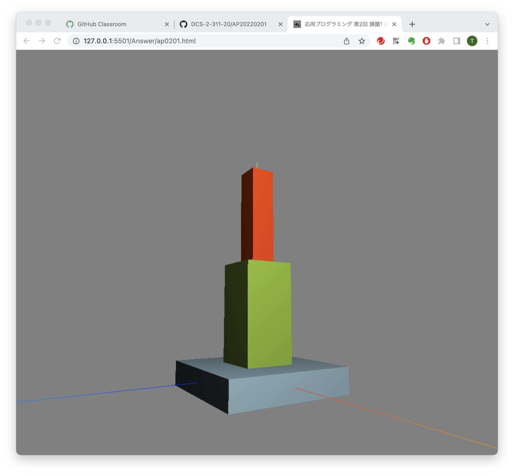

# 応用プログラミング 2022年度
## 第2回 課題1

1. GitHub上のリポジトリのクローンを自分のPCに作成する

1. クローンしたローカルリポジトリをVisual Studio Code(以下，VS Code) で開く

1. VS Code の Live Server を使って，表示を確認する．(座標軸だけが表示される)

1. ap0201.js を修正して，図のように表示されるようにする．

1. 変更をコミット(commit)してから，プッシュ(push)し，GitHub上のリポジトリが更新されていることを確認する．

1. 教員(またはSA)に，提出を確認してもらう．
